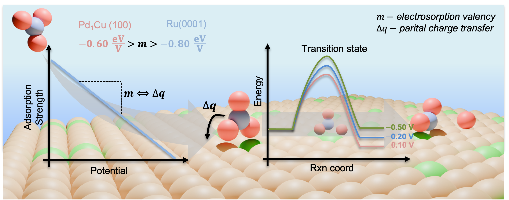

# README

## Potential Dependence of Nitrate Adsorption and Dissociation across Metals and Dilute Alloys: a Grand Canonical Study

This repository contains all data and code used for our manuscript titled: **"Potential Dependence of Nitrate Adsorption and Dissociation across Metals and Dilute Alloys: a Grand Canonical Study"**.

## Repository Structure

The repository is organized into three main directories:

### 1. [analytical_GC-DFT](./analytical_GC-DFT/)
This folder contains all input files and output coordinates for [adsorption](./analytical_GC-DFT/adsorption) and [dissociation](./analytical_GC-DFT/dissociation) studies performed on the (111) and (100) facets of pure metals and select single-atom alloys (SAAs) using **VASP**. 

- **Metal-Specific Directories:** Each metal has a dedicated directory containing:
  - Input files and optimized coordinates for structures optimized with **implicit solvation**.
  - Input files and optimized coordinates for structures optimized in **vacuum**.
  - `aGC-DFT_params.txt`: A file containing all the parameters used within the aGC-DFT model (found within the vacuum optimization folder).
- **Dissociation Studies:** To find the `aGC-DFT_params.txt` file for dissociation studies, navigate to the **transition state image** folder.
- **Other Directories:**
  - [INCARS](./analytical_GC-DFT/incars_4_analysis/) used for charge analyses, density of states calculations, and vibration analyses (Hessian computation).
  - [Input files and optimized coordinates](./analytical_GC-DFT/molecules/) for reference state molecules.

### 2. [explicit_GC-DFT](./explicit_GC-DFT)
This folder contains data and input files for explicit grand canonical DFT studies, focusing on Cu-based SAAs:

- [Stability Studies](./explicit_GC-DFT/stability/111/)
  - A directory for stability studies on the (111) facet of Cu-based SAAs.
  - These studies are organized by the **applied potential** and whether the study is a **segregation** or **aggregation** study.
- [NO₃ Adsorption and Dissociation Studies](./explicit_GC-DFT/cu_111_studies)
  - A directory containing adsorption and dissociation studies of **NO₃ on Cu(111)** for comparison to **aGC-DFT results**.
- **Other Directories:**
  - [Input files for vibration analyses and NEB calculations](./explicit_GC-DFT/ase-jdftx_inputs) using the **Atomic Simulation Environment (ASE)**.
  - [Input files and optimized coordinates](./explicit_GC-DFT/molecules) for reference state molecules.

### 3. [gc-dft_analysis](./analytical_GC-DFT)
This folder contains all data used within this study from both [aGC-DFT](./gc-dft_analysis/data/aGC-DFT_data.csv) and [eGC-DFT](./gc-dft_analysis/data/jdftx_data.csv) calculations, along with project density of states data for [pure metals](./gc-dft_analysis/data/pure_dos/) and [SAAs](./gc-dft_analysis/data/pure_dos/). We also provide the [code](./gc-dft_analysis/GC-DFT_analysis.ipynb) for analyzing this data. 

## Usage Instructions
Feel free to use any data/code in this repository for your own analyses or to understand the results presented within the main text. '

## License  
- **Code/Software**: Licensed under [MIT](./LICENSE-CODE).  
- **Data/Results**: Licensed under [CC BY 4.0](./LICENSE-DATA), requiring attribution to the original paper.  

*For attribution, please cite our work:*  
> [Your Paper Title], *Journal Name*, Year, DOI: [link]. 

