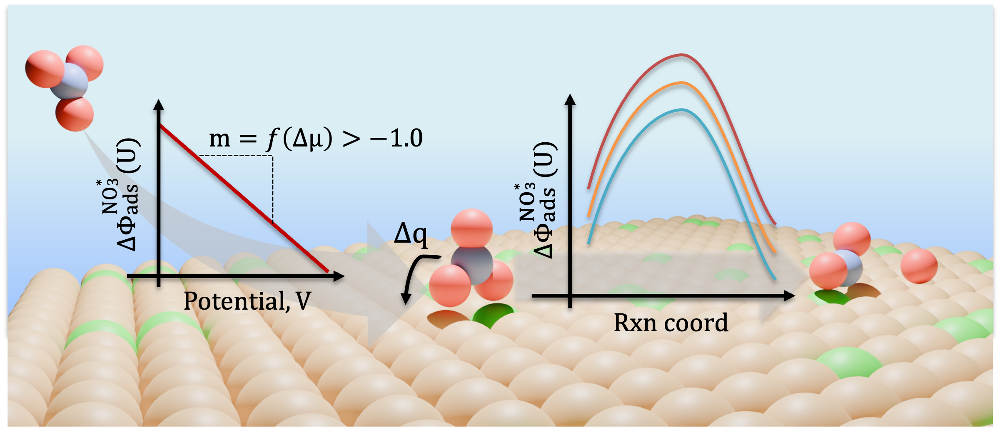

# README

## Potential Dependence of Nitrate Adsorption and Dissociation across Metals and Dilute Alloys: a Grand Canonical Study

This repository contains all data and code used for our manuscript titled: **"Potential Dependence of Nitrate Adsorption and Dissociation across Metals and Dilute Alloys: a Grand Canonical Study"**.

## Repository Structure

The repository is organized into three main directories:

### 1. `analytical_GC-DFT`
This folder contains all input files and output coordinates for adsorption and dissociation studies performed on the (111) and (100) facets of pure metals and select single-atom alloys (SAAs) using **VASP**. 

- **Metal-Specific Directories:** Each metal has a dedicated directory containing:
  - Input files and optimized coordinates for structures optimized with **implicit solvation**.
  - Input files and optimized coordinates for structures optimized in **vacuum**.
  - `aGC-DFT_params.txt`: A file containing all the parameters used within the aGC-DFT model (found within the vacuum optimization folder).
- **Dissociation Studies:** To find the `aGC-DFT_params.txt` file for dissociation studies, navigate to the **transition state image** folder.
- **Other Directories:**
  - A folder containing **INCARS** used for charge analyses, density of states calculations, and vibration analyses (Hessian computation).
  - A folder containing **input files and optimized coordinates** for reference state molecules.

### 2. `explicit_GC-DFT`
This folder contains data and input files for explicit grand canonical DFT studies, focusing on Cu-based SAAs:

- **Stability Studies:**
  - A directory for stability studies on the (111) facet of Cu-based SAAs.
  - These studies are organized by the **applied potential** and whether the study is a **segregation** or **aggregation** study.
- **NO₃ Adsorption and Dissociation Studies:**
  - A directory containing adsorption and dissociation studies of **NO₃ on Cu(111)** for comparison to **aGC-DFT results**.
- **Other Directories:**
  - A folder containing **input files for vibration analyses and NEB calculations** using the **Atomic Simulation Environment (ASE)**.
  - A folder containing **input files and optimized coordinates** for reference state molecules.

### 3. `gc-dft_analysis`
This folder contains all **data and code** used to analyze results from both **aGC-DFT** and **eGC-DFT** calculations.

## Usage Instructions
Feel free to use any data/code in this repository for your own analyses or to understand the results presented within the main text. 

